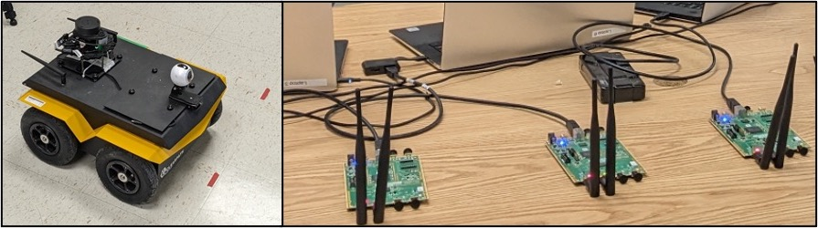

---
# Leave the homepage title empty to use the site title
title:
date: 2022-10-24
type: landing

sections:
  - block: about.biography
    id: about
    content:
      title: Overview
      # Choose a user profile to display (a folder name within `content/authors/`)
      username: lenslabintro
  - block: markdown
    id: moreaboutus
    content:
      title: More about us
      subtitle: ''
      text: We work with different programming environments, including [Gymnasium](https://gymnasium.farama.org/), python packages for machine learning, open source communication stacks such as [srsRAN](https://www.srslte.com/), and [OpenFlow](https://www.opennetworking.org/) for software defined networking (SDN).Hardware support includes GPU workstations from [Lambda Labs](https://lambdalabs.com/), Software Defined Radios (SDR) from [National Instruments](https://www.ni.com/en-us/innovations/white-papers/11/what-is-ni-usrp-hardware-.html) in both sub-six and mm-wave bands, a variety of robots such as [Jackal UGVs](https://clearpathrobotics.com/jackal-small-unmanned-ground-vehicle/), [Turtlebots](https://www.turtlebot.com/) and [Amazon DeepRacers](https://aws.amazon.com/deepracer/) and assorted Android-based smart devices.We are also supported in conducting real-world field experiments by the [Bush Combat Development Complex](https://bcdc.tamus.edu/) located at a former Air Force base located about ten miles away from the main campus.Participants are encouraged to act as a community of experts and talk about their experiences with one another. Prototyping often poses many technical challenges. Getting involved at the LENS lab entails being exposed to the frustrations and the rewards associated with open-ended engineering problems.         The lab is supported through the sponsorship of several organizations including Department of Electrical and Computer Engineering at Texas A&M University, National Instruments, Google, the National Science Foundation, and The US Army Futures Command, among others.     **Aggie Deep Racers**    This is an initiative specifically aimed at applied machine learning in a robotics context using the [Amazon DeepRacer](https://aws.amazon.com/deepracer/) platform.     
  - block: features
    content: 
      title: Courses Taught by Faculty
      text :    
      items:
        - name: ECEN 424 Fundamentals of Networking
        - name: ECEN 489 Artificial Intelligence 
        - name: ECEN 489 Mobile Applications with Android
        - name: ECEN 689 Reinforcement Learning
  - block: markdown
    id: news
    content:
      title: News
      subtitle: 
<<<<<<< HEAD
      text :  • My research is featured in the TAMU [Research Bulletin](https://research.tamu.edu/2023/04/25/strangers-in-a-strange-land-can-reinforcement-learning-teach-robots-to-operate-on-their-own-in-the-real-world/) and in the College of Engineering  [News](https://engineering.tamu.edu/news/2023/04/kalathil-addresses-reinforcement-learning-challenges.html)    • Sample featured in the TAMU [Research Bulletin](https://research.tamu.edu/2023/04/25/strangers-in-a-strange-land-can-reinforcement-learning-teach-robots-to-operate-on-their-own-in-the-real-world/) and in the College of Engineering  [News](https://engineering.tamu.edu/news/2023/04/kalathil-addresses-reinforcement-learning-challenges.html)
  

=======
      text :  • My research is featured in the TAMU [Research Bulletin](https://research.tamu.edu/2023/04/25/strangers-in-a-strange-land-can-reinforcement-learning-teach-robots-to-operate-on-their-own-in-the-real-world/) and in the College of Engineering  [News](https://engineering.tamu.edu/news/2023/04/kalathil-addresses-reinforcement-learning-challenges.html)    • Why is featured in the TAMU [Research Bulletin](https://research.tamu.edu/2023/04/25/strangers-in-a-strange-land-can-reinforcement-learning-teach-robots-to-operate-on-their-own-in-the-real-world/) and in the College of Engineering  [News](https://engineering.tamu.edu/news/2023/04/kalathil-addresses-reinforcement-learning-challenges.html)
  
  - block: collection
    id: featured
    content:
      title: Featured Publications
      filters:
        folders:
          - publication
        featured_only: true
    design:
      columns: '2'
      view: card
>>>>>>> 9fd7be1bfbd183104de32f5e5094d3685afeb206
  - block: collection
    content:
      title: Recent Research
      text: |-
        {}
        Quickly discover relevant content by [filtering publications](./publication/).
        {}
      filters:
        folders:
          - publication
        exclude_featured: true
    design:
      columns: '2'
      view: citation
  - block: markdown
    id: group
    content:
<<<<<<< HEAD
      title: Lab Gallery
      subtitle: Sneak peek into the lab and our team
=======
      title: Group
      subtitle: A subtitle
>>>>>>> 9fd7be1bfbd183104de32f5e5094d3685afeb206
      text: Add any **markdown** formatted content here - text, images, videos, galleries - and even HTML code!  
  - block: contact
    id: contact
    content:
      title: Contact
      subtitle:
      text: 
      # Contact (add or remove contact options as necessary)
<<<<<<< HEAD
      email: sshakkot@tamu.edu
=======
      email: lenslabtamu@gmail.com
>>>>>>> 9fd7be1bfbd183104de32f5e5094d3685afeb206
      phone: 1-979-458-0094
      address:
        street: 188 Bizzell St , Wisenbaker Engineering Building (WEB) - 002
        city: College Station
        region: TX
        postcode: '77840'
        country: United States
        country_code: US
      
      office_hours:
        - 'Monday 10:00 to 13:00'
        - 'Wednesday 09:00 to 10:00'
      # Automatically link email and phone or display as text?
      autolink: true
      # Email form provider
    design:
      columns: '2'
  
<<<<<<< HEAD
  # - block: collection
  #   id: featured
  #   content:
  #     title: Featured Publications
  #     filters:
  #       folders:
  #         - publication
  #       featured_only: true
  #   design:
  #     columns: '2'
  #     view: card
=======
  
>>>>>>> 9fd7be1bfbd183104de32f5e5094d3685afeb206

      
  
---
